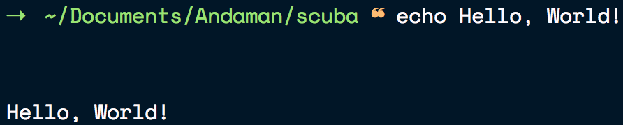

# zsh-theme-maestro

**maestro** is a Z Shell theme that I developed to learn how theming works in general with shells.

I intended to create something visually similar to the impressive [night owl theme](https://github.com/sdras/night-owl-vscode-theme) and with some of the best functionality that several themes provide but at the same time remain uncluttered.

It has the following features:

* The prompt character turns red when the previous command didn't run sucessfully(non-zero exit code).

* All directory paths are shown relative to the root.

* When in a Git repository, the path is shown relative to the project root.

* Displays the branch name when in a Git repository and indicates if it's dirty.

### License

MIT © [Sivasubramanyam A](https://sivasubramanyam.me)

